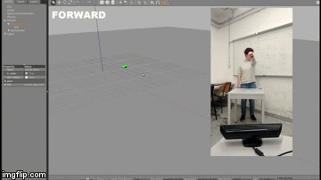
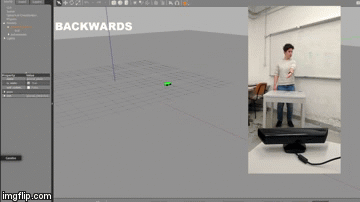

# Mobile Robot Teleoperation

Forward control:
 <p align="center">
  
 </p>
 
 Backward control:
 <p align="center">
  
 </p>

*Full video of the experiment can be seen at the following [link](https://youtu.be/Zv07ShMY1a4)*


## The System’s Architecture

The hardware is composed by a smartwatch, a kinect, a leap motion and the robot we want to move. The modules are wrote in cpp or in python.

### Description of the Modules

The architecture is composed by three sensors that get information regarding the arm and interface to the PC using the respective drivers. The adapter nodes receive the orientation data from the respective sensors and in different ways convert them into RPY data and then send everything to the controller. The controller receives RPY angles which are easier to interpret than quaternions and converts them into linear and angular velocities, makes the average and sends the actual velocities to the robot.

### Kinect Module

This module takes in input the tf transforms from the kinect data preprocessed by the openny_tracker module, and gives as output the corresponding RPY (roll-pitch-yaw) data.

### Leap Motion Module

This module takes in input images taken by two cameras are analyzed to reconctruct a 3D representation of what the device sees. Tracking algorithms interprat the 3D data and infer the pitch and the roll of occluded objects.

### Smartwatch Module 

The smartwatch module takes as input the data sent by the smartwatch, filtered by the Complementary Filter Node, and gives as output the corresponding RPY (roll-pitch-yaw) data.

### Kinect Module

The Kinect module takes as input the data sent by the Kinect and gives as output an RPY message. 

### Controller Module 

The controller module takes as input the RPY data sent by the three adapter of the sensors and converts them into linear and angular velocities. Then it computes the weighted average between the velocities available and gives as output the actual velocity that the robot has to take.

### Gazebo Simulation

During the test phase the simulator listen at the topic /cmd_vel and a simulated hrp_automower moves in Gazebo according to the message received.


### Kinect-Unity-Oculus modules

The objective of this modules is to create a 3D pointcloud map from the images acquired by a Microsoft Kinect in a ROS environment on Linux, to transmit it to a Windows based Unity project which will tweak and improve the map in order to make it more user-friendly before sending it to the Oculus visor weared by the user.
The Kinect could be even mounted on a moving robot in order to create a real-time dynamic map of its surrounding.

## Implementation

### Prerequisites

Hardware prerequisites:

1. LG G Watch R W110

1. LG G6 H870

1. Kinect Sensor v1

1. Husqvarna Automower

Software prerequisites:

1. ROS kinetic, to download it follow [this guide](http://wiki.ros.org/kinetic/Installation/Ubuntu).

1. Imu Stream, a set of Android applications (mobile and wear) to stream IMU data from the smartwatch to an MQTT broker. For more feature follow [this guide](http://github.com/EmaroLab/imu_stream).

1. Mosquitto on Ubuntu, to download it follow [this guide](https://www.digitalocean.com/community/tutorials/how-to-install-and-secure-the-mosquitto-mqtt-messaging-broker-on-ubuntu-16-04).

1. To install the required libraries for the Kinect Sensor follow the README in the src/kinect_listener folder.

1. GAZEBO robotic simulator for ROS, to download it follow [this guide](http://gazebosim.org/tutorials?tut=ros_installing). 

### How to run the project

1. Clone this repository in your workspace through the command 
	```bash
    git clone
    ```

### Kinect Setup

1. Follow the [README](https://github.com/cesca95/hrp_teleoperation/blob/master/src/kinect_listener/README.md) in the src/kinect_listener folder

### Leap Motion Setup

1. Follow the [README](https://github.com/cesca95/hrp_teleoperation/blob/master/src/leap_teleop/README.md) in the src/leap_teleop folder

### Smartwatch Setup

1. Set up mqtt_ros_bridge by following the [README](https://github.com/EmaroLab/mqtt_ros_bridge/blob/9fc463c696403b45a9c36afe6a5cabf9d7522423/README.md) in the src/mqtt_ros_bridge folder and set up Smartwatch device by following the [README](https://github.com/cesca95/hrp_teleoperation/blob/master/src/smart_watch/README.md) 

### For the simulation on Gazebo (Optional)

1. (ONLY IF YOU WANT TO SIMULATE ON GAZEBO)For the simulation of the Husqvarna Automower on GAZEBO install all the dependencies (for more info about this part look at [this guide](https://github.com/HusqvarnaResearch/hrp/blob/master/Startup%20Guide%20HRP.pdf)) 
	```bash
	sudo apt-get install ros-kinetic-gazebo-ros-control
	sudo apt-get install ros-kinetic-joint-state-controller
	sudo apt-get install ros-kinetic-hector-gazebo-plugins
	sudo apt-get install ros-kinetic-hector-gazebo
	sudo apt-get install python-pygame
	```

1. Setup the model path
	```bash
	export GAZEBO_MODEL_PATH=[your path]/src/haro/am_gazebo/models:$GAZEBO_MODEL_PATH
	```
	
### Kinect-Unity-Oculus Setup

1. Follow the README in the Unity branch

Note: the Kinect-Unity-Oculus interface section it still is on the relative "Unity" branch since it must be cloned on a different machine than the one above. The relative complete Readme it can be found on the above mentioned branch.


### Compilation and running

1. Compile your workspace
	```bash
	catkin_make
	```

1. Kinect:
   ```bash
   (Terminal 1)  roslaunch openni_launch openni.launch camera:=openni
   ```

1. Smartwatch:
    Check the Mosquitto broker status.
    ```bash
    sudo service mosquitto status
    ```

1. Start the Mosquitto broker. (if the broker is already active skip this step)
    ```bash
    (Terminal 2) mosquitto
    ```

1. Leap Motion:
   ```bash
   (Terminal 3) LeapControlPanel
   (Terminal 4) roslaunch leap_motion sensor_sender.launch
   ```

1. In another terminal tab launch the controller and all the other nodes (inside the launch file you could comment components not needed, for example those
 for the simulation)
	```bash
    (Terminal 5) roslaunch controller controller.launch
    ```
1. In order to start the simulation on gazebo
	```bash
    (Terminal 6) roslaunch am_gazebo am_gazebo_hrp.launch gui:=true
    ```
   
1. To run the Kinect-Unity-Oculus side follow the guide in the Unity branch
    
## Results
The three sensors were fully tested and we can conclude that the Husqvarna Automower is totally controllable through the usage of them. In order to look at the simulation developed during the test phase follow this [link](https://youtu.be/Zv07ShMY1a4).
All the three modules (Kinect-Unity-Oculus) have been thoroughly tested and have demonstrated to be fully working. 
The final implementation allows the user to visualize the entirety of the map in a realistic and dynamic way while the virtual environment keeps expanding as the robot explores its surroundings.
You can see the implemented Kinect-Unity-Oculus architecture working in the following videos:

[Kinect - Unity - Oculus interface Video 1](https://www.youtube.com/watch?v=akuiFXSs5n4)

[Kinect - Unity - Oculus interface Video 2](https://www.youtube.com/watch?v=fg03l9Zvy0s)


## Recommendations
During the test phase some issues raised, one of them is the fact that the connection between smartwatch, smartphone and computer introduce a considerable delay that retard the movement of the robot with respect to the smartwatch orientation.

## Authors
* Noel Alejandro Avila Campos: nono.nonex@gmail.com
* Nicola De Carli: s4198668@studenti.unige.it
* Angelica Ginnante: angelica.ginnante@gmail.com
* Adam Berka: berkaadam7@gmail.com
* Nicolas Dejon: nicolas.dejon@etu.utc.fr
* Enrico Casagrande: erri.casagrande@gmail.com
* Alberto Ghiotto: alberto.ghiotto@hotmail.it
* Alberto Grillo: albogrillo@gmail.com
* Claudio Curti: curti.claudio96@gmail.com
* Francesca Cantoni: francescacantoni95@gmail.com
